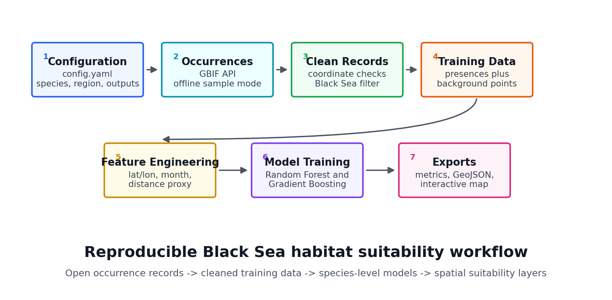
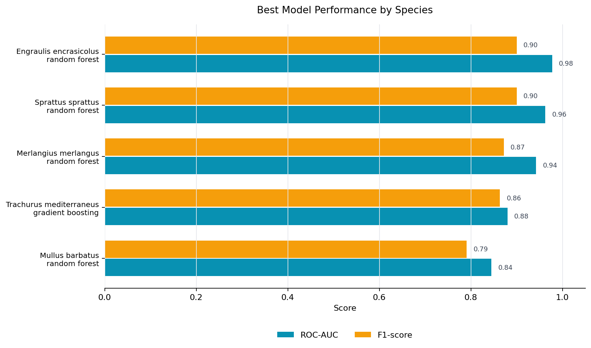
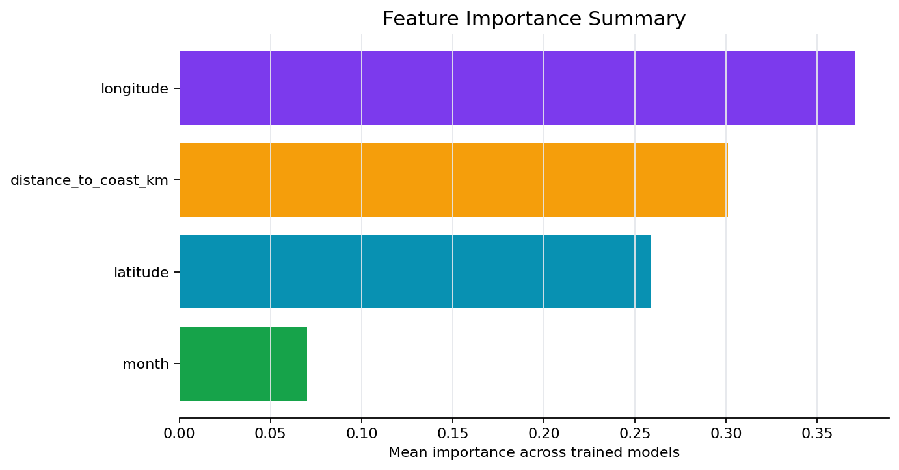
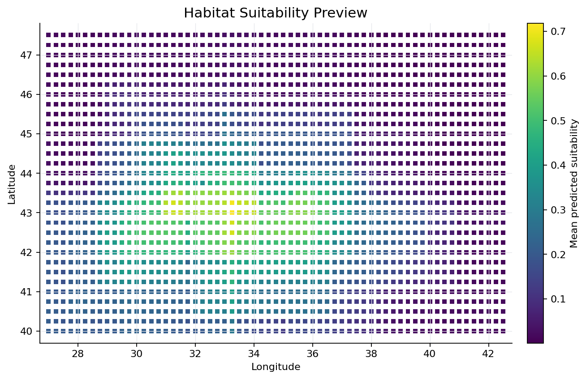

# Black Sea Species Distribution Modeling

**Repository guide:** [Overview](#overview) · [Methodology](#methodology-overview) · [Usage](#usage) · [Limitations](#limitations) · [Structure](#repository-structure)

Reproducible Python GIS and machine learning pipeline for estimating habitat
suitability of selected Black Sea marine species from open biodiversity
occurrence records and lightweight spatial features.

The pipeline runs without paid APIs, private credentials, Copernicus login, or
large raster downloads, while leaving clear extension points for richer
oceanographic data.



## Overview

This repository builds species-level habitat suitability models for selected
Black Sea marine species. It fetches occurrence records from GBIF, cleans and
filters records to the Black Sea region, creates pseudo-absence/background
samples, engineers spatial and seasonal features, trains Random Forest and
Gradient Boosting classifiers, and exports model evaluation tables,
feature-importance summaries, GeoJSON predictions, and an interactive map.

Configured species:

- `Engraulis encrasicolus`
- `Trachurus mediterraneus`
- `Sprattus sprattus`
- `Merlangius merlangus`
- `Mullus barbatus`

## Methodology Overview

1. Load project settings from `config.yaml`.
2. Fetch coordinate-bearing GBIF occurrence records for each configured species.
3. Query GBIF with the configured Black Sea bounding box, then re-filter locally.
4. Remove invalid coordinates, duplicate observations, and out-of-region records.
5. Extract month and broad seasonality from occurrence dates when available.
6. Generate species-specific pseudo-absence/background points inside the region.
7. Engineer model features:
   - latitude
   - longitude
   - month
   - approximate distance to region edge as a v1 distance-to-coast fallback
   - optional bathymetry if a local GEBCO raster is supplied
8. Train Random Forest and Gradient Boosting classifiers per species.
9. Evaluate models with ROC-AUC, precision, recall, and F1-score.
10. Predict suitability over a regular spatial grid.
11. Export CSV summaries, feature importance, GeoJSON prediction layers, and an
    interactive HTML map.

## Pipeline Architecture

```text
config.yaml
  -> src/fetch_gbif.py
  -> src/clean_occurrences.py
  -> src/pseudo_absence.py
  -> src/features.py
  -> src/train_model.py
  -> src/evaluate_model.py
  -> src/build_black_sea_grid.py
  -> src/make_maps.py
  -> output/
```

Core modules:

- `src/config.py`: typed configuration loading and path management
- `src/fetch_gbif.py`: public GBIF occurrence API integration
- `src/fetch_obis.py`: honest optional OBIS extension placeholder
- `src/clean_occurrences.py`: coordinate validation, bounding-box filtering,
  duplicate removal, and species summaries
- `src/pseudo_absence.py`: reproducible background sampling
- `src/features.py`: spatial, seasonal, and optional raster feature extraction
- `src/train_model.py`: Random Forest and Gradient Boosting training
- `src/evaluate_model.py`: metrics and feature-importance exports
- `src/make_maps.py`: GeoJSON and interactive map outputs
- `src/run_pipeline.py`: command-line orchestration

## Output Examples







The interactive version is generated at:

```text
output/habitat_suitability_map.html
```

## Data Sources

- **GBIF**: implemented in v1 through the public occurrence search API.
- **OBIS**: optional placeholder only. The pipeline logs a warning if OBIS is
  enabled and continues without pretending to download OBIS records.
- **GEBCO bathymetry**: optional local raster support. Add a local raster at
  `data/external/gebco_black_sea.tif`, enable GEBCO and depth in `config.yaml`,
  and install `rasterio`.
- **Copernicus Marine, SST, salinity, chlorophyll**: documented future
  extensions. They are not required for the current reproducible version.

## Model Evaluation

The pipeline trains two classifiers per species:

- Random Forest classifier
- Gradient Boosting classifier

Evaluation metrics are written to `output/model_metrics.csv`:

- ROC-AUC
- precision
- recall
- F1-score
- train/test record counts
- classification threshold

Feature importances for supported models are exported to
`output/feature_importance.csv`.

## Installation

Use Python 3.10 or newer.

```bash
python -m venv .venv
source .venv/bin/activate
pip install --upgrade pip
pip install -r requirements.txt
```

For optional raster bathymetry support:

```bash
pip install rasterio
```

## Usage

Run the full GBIF-backed pipeline:

```bash
python -m src.run_pipeline --config config.yaml
```

Run deterministic offline sample mode:

```bash
python -m src.run_pipeline --config config.yaml --sample
```

Sample mode is useful for testing the complete workflow without network access
or when GBIF is temporarily unavailable.

## Generated Files

A successful run creates:

```text
output/clean_occurrences.csv
output/training_dataset.csv
output/model_metrics.csv
output/feature_importance.csv
output/prediction_grid.geojson
output/habitat_suitability_map.html
output/species_summary.csv
```

Intermediate reproducible files are written under:

```text
data/raw/
data/processed/
```

Generated data and model outputs are intentionally ignored by git. Small static
README visuals are committed under `assets/`.

## Limitations

- The v1 prediction area uses the configured Black Sea bounding box, not a
  coastline-clipped sea polygon.
- Distance to coast is approximated as distance to the region edge unless a
  coastline layer is added later.
- Pseudo-absence points are background samples, not verified biological
  absences.
- Random train/test splits can overstate performance for spatial data; spatial
  cross-validation is a recommended extension.
- GBIF occurrence data may contain sampling bias, taxonomic noise, or uneven
  observation effort.
- Sample mode uses synthetic data for offline validation only.
- Large environmental rasters are not downloaded automatically.

## Optional Extensions

- Add a Black Sea coastline polygon and compute true distance to coast.
- Add GEBCO bathymetry sampling with CRS-aware reprojection.
- Implement OBIS as an optional second occurrence source.
- Add local SST, salinity, chlorophyll, or NetCDF-derived features.
- Add Copernicus Marine support only when credentials and a small reproducible
  subset are explicitly configured.
- Add spatial cross-validation and per-species threshold optimization.

## Repository Structure

```text
black-sea-species-distribution-modeling/
├── assets/
├── data/
│   ├── raw/
│   ├── processed/
│   └── external/
├── notebooks/
├── output/
├── src/
├── config.yaml
├── requirements.txt
├── README.md
└── .gitignore
```
